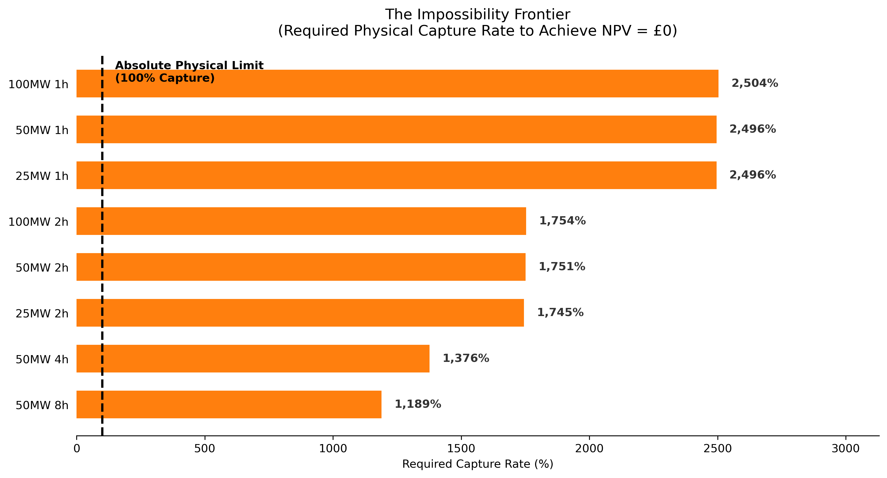

# Executive Summary

**The Economic Viability of BESS for North-West Transmission Constraint Relief**

The assets the grid physically prefers (4h–8h) face the highest economic hurdles, while the assets most readily funded by current markets (1h–2h) provide less effective relief for persistent congestion.

*Figure 1 — The Physical-Economic Tension.* 

## The Core Insight

This study evaluates whether persistent North-West transmission constraints create economically viable opportunities for standalone Battery Energy Storage Systems (BESS). By bridging physical grid behaviour with rigorous project finance modelling, the analysis reveals a fundamental market failure: **the GB flexibility market is trapped in a "pincer movement."**

Constraint-management revenue alone is insufficient to justify standalone investment. More critically, **constraint revenue cannot rescue a structurally impaired merchant case.** Even when tested as a marginal top-up to a stacked revenue strategy, the required break-even performance from other markets (£100k–£380k/MW-year) is materially above recent market norms that dominate the connection queue, and commercially unachievable for long-duration assets. 

Consequently, the free market is currently incapable of self-correcting to deploy the physical assets the grid actually needs.

---

## 1. The Physical Reality: Friction Dominates Opportunity

Initial screening identified substantial theoretical "Gross Opportunity" (£500m+ over the study period) concentrated within a small number of North-West constraint groups (e.g., GALLEX, NKILGRMO). However, when realistic physical operating limits are applied, the accessible revenue collapses.

*Figure 2 — Constraint Burden Concentration. Operational burden is hyper-concentrated within a small number of North-West transmission boundaries.*

* **The 1.7% System-Level Capture Rate:** A representative 50MW 4h battery captures approximately 1.7% of the total system constraint opportunity. While this is not a meaningful benchmark for individual asset selection (as no single asset can capture the entire North-West), it is a critical insight for system planners: **storage at this scale cannot substitute for strategic transmission reinforcement.**
* **Power Before Energy:** The primary limiting factor is instantaneous power capability (Static Failure), not energy depletion. Most missed opportunity occurs because the asset lacks the MW rating to respond to peak constraint events.

*Figure 3 — The Coverage Frontier. Increasing instantaneous power capability captures materially more value than increasing energy duration alone.*

---

## 2. The Economic Reality: The Merchant Case is Structurally Impaired

NB15 introduced rigorous, pre-tax, unlevered project finance modelling to test standalone viability. The results demonstrate that constraint revenue acts only as a marginal top-up to a broader, highly pressured revenue stack.

*Figure 4 — The Opportunity Funnel. Theoretical system value is filtered by physical friction and time, collapsing to a fraction of its original scale before becoming investable revenue.*

* **Structural Cash Deficit:** Across 40 tested configurations and 5 constraint groups, **100% of assets failed the Revenue Sufficiency Test**. The best-case scenario generated enough constraint revenue to cover only **5%** of annual Fixed O&M.
* **Zero Probability of Success:** A 10,000-iteration Monte Carlo simulation, stress-testing wide distributions of revenue, Capex, Opex, and discount rates, resulted in a **0.0000% probability of positive NPV** for all configurations when relying on constraint revenue as a primary driver.
* **The Viability Threshold:** To achieve a break-even NPV, a trading desk must generate between **£100,000 and £380,000 per MW per year** from stacked markets (Arbitrage, Capacity Market, FFR), depending on asset duration. 

---

## 3. The Strategic Tension: A Market Trapped in a Pincer Movement

The most critical finding of this project is the divergence between what the grid physically needs and what the market will fund. 

*Figure 5 — Revenue Sufficiency Test. Constraint-management revenue fails to cover basic operating costs for all tested configurations.*

* **The Long End (4h–8h) has a Relative Physical Advantage, but is Unfundable:** While longer-duration assets capture more constraint value (8h > 4h > 2h), the absolute revenue remains modest across all configurations (£18k–£73k/year). The massive energy Capex of a 4h+ asset requires a trading performance of >£220,000/MW-year to break even. This "Physical Sweet Spot" is a relative, not absolute, statement: longer duration is physically preferable, but the absolute revenue is not economically sufficient.
* **The Short End Faces Growing Revenue Compression:** The market has historically funded 1h–2h assets because their lower Capex requires only £100,000–£140,000/MW-year to break even. However, the connection queue is now oversaturated with ~1.6-hour assets targeting short-duration frequency response (DC/DM) and price surges. This massive oversupply is crashing ancillary service prices, driving the merchant revenue stack below the break-even threshold.

**Conclusion:** The market is building short-duration assets for financial survival, even though these assets are physically misaligned with the long-duration nature of the underlying transmission bottleneck. Furthermore, the primary business case for those short-duration assets (merchant surges) is collapsing due to oversupply.

---

## 4. Strategic Implications

### For BESS Developers & Investors
1. **Constraint Revenue Cannot Rescue a Broken Merchant Case:** Do not underwrite projects based on constraint-relief revenue. It must be modelled as a marginal top-up (covering <5% of Opex). If the underlying merchant arbitrage/ancillary case is impaired by cannibalisation, constraint revenue will not save it.
2. **Cost Deflation Alone Cannot Bridge the Gap:** Even under aggressive Capex assumptions (£200/kWh), long-duration assets (4h+) require stacked revenue targets (>£160k/MW-year) that are not currently achievable in GB merchant markets. 
3. **Scope Caveat — Co-location and Hybridisation:** This analysis assumes a standalone merchant BESS. Co-location with renewables (sharing grid connection costs) or hybridisation may improve project economics. However, the fundamental tension—that constraint relief is a marginal top-up, not a primary business case—remains relevant for all BESS configurations.

### For NESO & Network Planners
1. **Wires are Mandatory; Batteries are Buckets:** A single BESS asset captures <2% of the total system constraint opportunity. Storage can alleviate marginal operational stress, but it cannot substitute for strategic transmission reinforcement (e.g., Eastern Green Link) when congestion becomes structural. 
2. **The market shows limited evidence of self-correcting under current incentive structures:** Because the short-duration merchant market is broken and the long-duration market is unfundable, NESO cannot rely on merchant developers to organically deploy the 4h–8h assets required to manage the transition before wires are finished.

### For Ofgem & Policymakers
1. **Proven Market Failure Requires Structural Intervention:** The market failure is not simply that revenues are low — it is that the **price signal for duration is structurally weak**. Short-duration assets compete on a crowded field for transient events; long-duration assets provide sustained relief but are not compensated for that persistence. The Transitional Duration Capacity Market (TDCM) and Locational Energy Pricing (LEP) are therefore not discretionary policy options — they are structural necessities to align financial incentives with physical reality.

---

## 5. Conclusion

The North-West transmission system exhibits persistent, clustered congestion that cannot be fully explained by short-term market volatility. 

While future market conditions may evolve, the magnitude of the gap between physical need and economic viability (a factor of ~5–10x in required revenue) suggests that incremental price volatility alone is unlikely to resolve the structural tension. A fundamental market design intervention — not passive price evolution — is required.

Future system resilience will depend not on hoping merchant batteries will organically solve grid bottlenecks, but on the successful, coordinated evolution of **strategic transmission reinforcement** (the physical pipe) and **targeted market design reform** (aligning financial incentives with physical reality).

*Figure 6 — Probabilistic Reality Check. Across 10,000 simulations of market and cost variables, the probability of a positive NPV remains exactly 0.00%.*

*Figure 7 — The Impossibility Frontier. To achieve break-even on constraint revenue alone, assets would need to capture >100% of the physical opportunity, violating the laws of physics.*

*Figure 8 — Sensitivity Hierarchy. Revenue attribution and physical limits dominate all financial assumptions (Capex, Discount Rate), proving the robustness of the non-viability conclusion.*