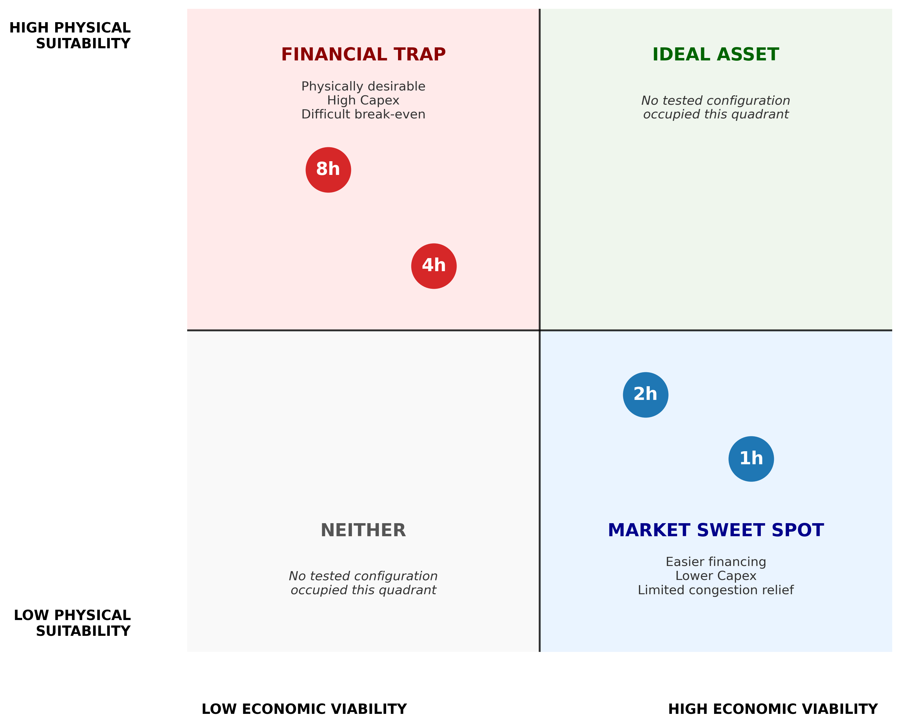
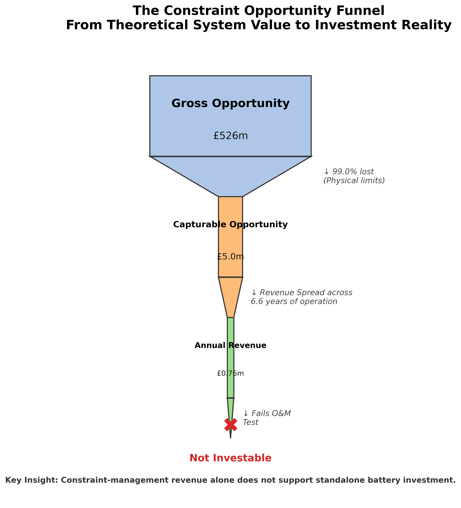
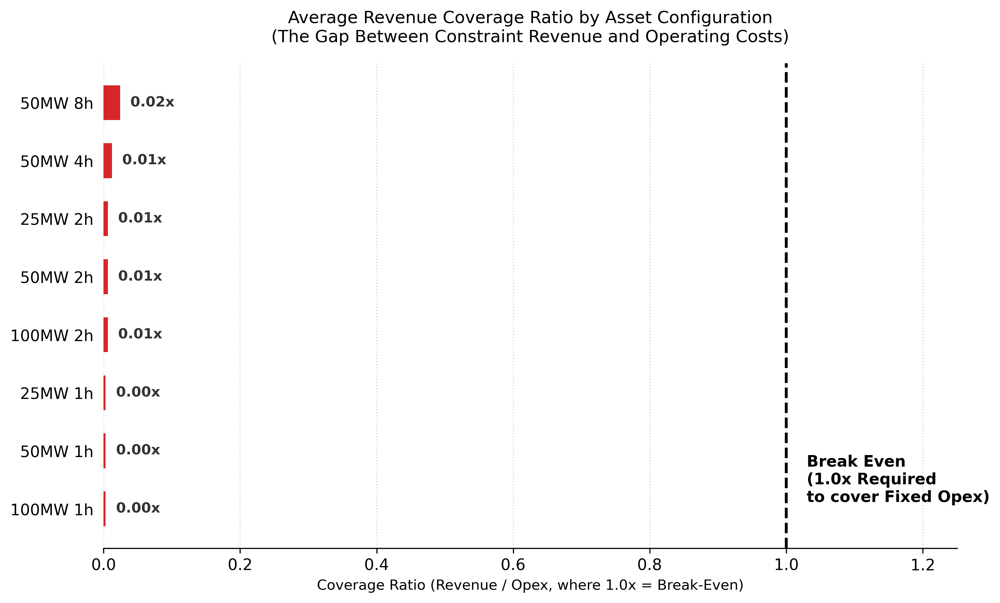
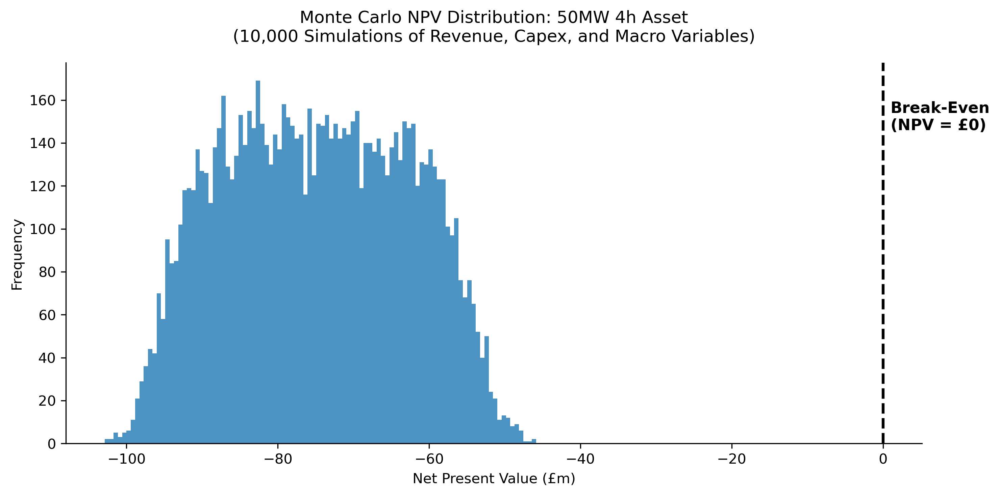
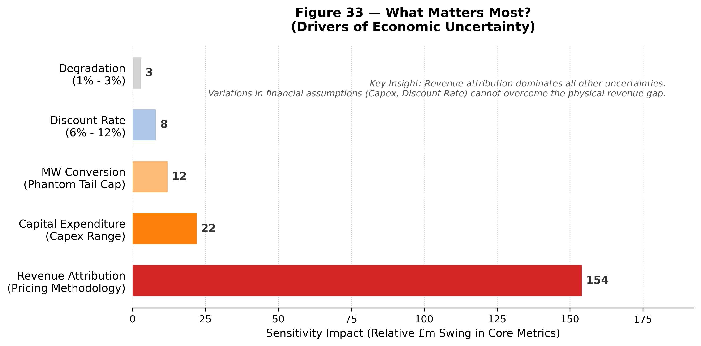

# Executive Summary

## The Economic Viability of BESS for North-West Transmission Constraint Relief

The assets the grid physically needs (4h–8h) face the highest economic hurdles, while the assets most readily funded by current markets (1h–2h) provide less effective relief for persistent congestion.

*Figure 1 — The Opportunity Gap. Gross system-level value collapses to a fraction of its original scale when physical limits are applied. The assets the grid physically needs (4h–8h) are financially unfundable, while the assets the market funds (1h–2h) are physically inadequate.*

---

## The Core Insight

This study evaluates whether persistent North-West transmission constraints create economically viable opportunities for standalone Battery Energy Storage Systems (BESS). By bridging physical grid behaviour with rigorous project finance modelling, the analysis reveals a fundamental market failure: **the GB flexibility market is trapped in a "pincer movement."**

Constraint-management revenue alone is insufficient to justify standalone investment. More critically, constraint revenue cannot rescue a structurally impaired merchant case. Even when tested as a marginal top-up to a stacked revenue strategy, the required break-even performance from other markets (£100k–£380k/MW-year) is materially above recent market norms that dominate the connection queue, and commercially unachievable for long-duration assets.

Consequently, current market signals appear unable to self-correct toward deployment of the assets required by the physical system.

---

## Decision Summary

| **Question** | **Finding** |
|--------------|-------------|
| Does North-West congestion create a genuine physical need? | Yes — constraints are persistent, clustered, and geographically concentrated. |
| Can standalone BESS solve the constraint problem? | No — a representative 50MW 4h asset captures only ~1.7% of total system opportunity. |
| What is the primary physical limit on BESS performance? | Power capability during constraint events, not energy duration between events. |
| Is constraint revenue an investable standalone business case? | No — constraint revenue covers only a small fraction of operating costs. |
| What is the likely solution pathway? | Transmission reinforcement, better locational incentives, and alternative deployment models such as hybridisation. |

---

## 1. The Physical Reality: Friction Dominates Opportunity

Initial screening identified substantial theoretical gross constraint opportunity under the conservative Episode Mean valuation methodology (**£500m+ over the 6.6-year study period**), concentrated within a small number of North-West constraint groups (e.g., GALLEX, NKILGRMO).

However, before evaluating revenue, we must establish the physical survivability of the assets. A common assumption is that clustered constraint events drain batteries, creating severe recharge risk. Historical state-of-charge simulations prove the opposite: recovery windows between episodes are vast, and assets begin virtually every constraint event fully charged.

*Figure 2 — Recovery Window Storyboard. Historical constraint episodes are separated by recovery periods that exceed recharge requirements, demonstrating that inter-episode recovery is not the binding constraint.*

*Figure 3 — Safety Margin Distribution. Historical recovery windows (blue) exceed required recharge durations (red threshold) across the analysed episode population. No episode entered the recharge-risk region, confirming that inter-episode recovery is not the binding constraint.*

The failure is not *between* episodes; it is *during* them.

Using a "Pipe and Tank" framework, the study separates two failure modes:

- **Static Failure:** insufficient MW capability to respond during the constraint event.
- **Dynamic Depletion:** insufficient MWh duration after dispatch begins.

Historical simulations show that **Static Failure dominates**. The battery does not usually fail because the tank empties; it fails because the pipe is too narrow to access the available opportunity.

*Figure 4 — The Feasibility Pipe & Tank Framework. Power capability is the first-order physical constraint. Energy capacity only becomes valuable after the asset can physically access the constraint event.*

When this physical filtration is applied, the accessible revenue collapses:

| **Stage** | **Value (50MW 4h Representative Asset)** | **What it Represents** |
|-----------|-------------------------------------------|------------------------|
| Gross System Opportunity | ~£890m | Total theoretical value of all NW constraint events under Episode Mean pricing |
| Capturable Revenue (Historical) | ~£15.3m | What a 50MW 4h asset could capture over 6.6 years after physical limits |
| Annualised Capturable Revenue | ~£2.3m/year | What a developer receives per year after physics and time |

After applying these physical constraints, a representative 50MW 4h BESS captures approximately **1.7%** of the total system constraint opportunity. This does not indicate poor asset performance. Rather, it demonstrates that **a single storage asset cannot substitute for a system-scale transmission constraint.**

*Figure 5 — Constraint Burden Concentration. Operational burden is hyper-concentrated within five North-West transmission boundaries, which account for ~95% of identified opportunity.*

The filtration reveals two dominant physical insights that determine what remains:

**Power Before Energy:** The primary limiting factor is instantaneous power capability (Static Failure), not energy depletion. Most missed opportunity occurs because the asset lacks the MW rating to respond to peak constraint events. Energy adequacy only becomes relevant after power requirements are satisfied — and for the representative asset, this was rarely the binding constraint.

*Figure 6 — The Coverage Frontier. Increasing instantaneous power capability captures materially more value than increasing energy duration alone, confirming that power is the first-order physical hurdle.*

> **Note:** Economic opportunity estimates are sensitive to revenue attribution methodology. The conservative baseline uses Episode Mean pricing, which values all constraint episodes using their average stress premium. A positive-only pricing methodology provides an upper-bound sensitivity case by excluding zero-value periods. While absolute opportunity estimates vary materially, the physical capture conclusion remains unchanged.

---

## 2. The Economic Reality: The Merchant Case is Structurally Impaired

NB15 introduced rigorous, pre-tax, unlevered project finance modelling to test standalone viability. The results demonstrate that constraint revenue acts only as a marginal top-up to a broader, highly pressured revenue stack.

*Figure 7 — The Opportunity Funnel. Theoretical system value is filtered by physical friction and time, collapsing to a fraction of its original scale before becoming investable revenue.*

**Structural Cash Deficit:** Across 40 tested configurations and 5 constraint groups, **100% of assets failed the Revenue Sufficiency Test**. The best-case scenario (50MW 8h at NKILGRMO) generated enough constraint revenue to cover only **5%** of annual Fixed O&M. All assets operate at a structural cash deficit from Year 1, rendering IRR and Payback mathematically undefined.

**Zero Probability of Success:** A 10,000-iteration Monte Carlo simulation, stress-testing wide distributions of revenue, Capex, Opex, and discount rates, resulted in a **0.0000% probability of positive NPV** for all configurations when relying on constraint revenue as a primary driver.

**The Break-Even Revenue Target:** To achieve a break-even NPV, a trading desk must generate between **£100,000 and £380,000 per MW per year** from stacked markets (Arbitrage, Capacity Market, FFR), depending on asset duration.

| **Asset Duration** | **Break-Even Revenue Target (£/MW-year)** |
|--------------------|-------------------------------------------|
| 1h | £100,000 |
| 2h | £140,000 |
| 4h | £220,000 |
| 8h | £380,000 |

These targets are **not optional** — they represent the minimum revenue required from all stacked markets combined to avoid negative NPV. Constraint revenue contributes a negligible fraction of this requirement.

*Figure 8 — Revenue Sufficiency Test. Constraint-management revenue fails to cover basic operating costs for all tested configurations. The gap between actual revenue and the break-even line is approximately 20x–50x.*

---

## 3. The Strategic Tension: A Market Trapped in a Pincer Movement

The most critical finding of this project is the divergence between what the grid physically needs and what the market will fund. The GB BESS market is currently caught in a structural pincer movement:

**The Long End (4h–8h) is Unfundable:** While longer-duration assets capture more constraint value (8h > 4h > 2h), the absolute revenue remains modest across all configurations (£18k–£73k/year under Episode Mean pricing). The massive energy Capex of a 4h+ asset requires a trading performance of >£220,000/MW-year to break even. This "Physical Sweet Spot" is a relative, not absolute, statement: longer duration is physically preferable for constraint relief, but the revenue is not economically sufficient to justify the capital outlay.

**The Short End Faces Growing Revenue Compression:** The market has historically funded 1h–2h assets because their lower Capex requires only £100,000–£140,000/MW-year to break even — targets that were achievable under historical market conditions. However, the connection queue is now oversaturated with ~1.6-hour assets targeting short-duration frequency response (DC/DM) and price surges. This massive oversupply is crashing ancillary service prices, driving the merchant revenue stack below the break-even threshold.

| **Asset Duration** | **What the Grid Needs** | **What the Market Funds** | **The Gap** |
|--------------------|-------------------------|---------------------------|-------------|
| 1h–2h | Limited value for persistent constraints | Financially viable (low Capex) | Physically inadequate |
| 4h–8h | Required for sustained constraint relief | Financially unviable (high Capex) | Economically unfundable |

**Conclusion:** The market is building short-duration assets for financial survival, even though these assets are physically misaligned with the long-duration nature of the underlying transmission bottleneck. Furthermore, the primary business case for those short-duration assets (merchant surges) is collapsing due to oversupply. The market cannot self-correct to deploy the assets the grid actually needs.

*Figure 9 — Probabilistic Reality Check. Across 10,000 simulations of market and cost variables, the probability of a positive NPV remains exactly 0.00% for all tested asset configurations. Distribution shown for 50MW 4h asset. All other configurations exhibit similarly negative distributions.*

---

## 4. Strategic Implications

### For BESS Developers & Investors

1. **Constraint Revenue Cannot Rescue a Broken Merchant Case:** Do not underwrite projects based on constraint-relief revenue. It must be modelled as a marginal top-up (covering <5% of Opex). If the underlying merchant arbitrage/ancillary case is impaired by cannibalisation, constraint revenue will not save it.

2. **Cost Deflation Alone Cannot Bridge the Gap:** Even under aggressive Capex assumptions (£200/kWh), long-duration assets (4h+) require stacked revenue targets (>£160k/MW-year) that are not currently achievable in GB merchant markets. The gap is structural, not parametric.

3. **Scope Caveat — Co-location and Hybridisation:** This analysis assumes a standalone merchant BESS. Co-location with renewables (sharing grid connection costs) or hybridisation may improve project economics. However, the fundamental tension — that constraint relief is a marginal top-up, not a primary business case — remains relevant for all BESS configurations.

4. **Site Selection Dictates the Scale of the Top-up:** Economic opportunity is hyper-concentrated. Securing a connection at a top-tier node (e.g., GALLEX, NKILGRMO) dictates the magnitude of the constraint revenue top-up far more than tweaking the MW/MWh configuration. However, even at the best sites, the top-up remains marginal.

### For NESO & Network Planners

1. **Wires are Mandatory; Batteries are Buckets:** A single BESS asset captures <2% of the total system constraint opportunity. Storage can alleviate marginal operational stress, but it cannot substitute for strategic transmission reinforcement (e.g., Eastern Green Link) when congestion becomes structural. You cannot empty an ocean using a bucket.

2. **The Market Cannot Self-Correct Under Current Incentive Structures:** Because the short-duration merchant market is broken and the long-duration market is unfundable, NESO cannot rely on merchant developers to organically deploy the 4h–8h assets required to manage the transition before wires are finished.

### For Ofgem & Policymakers

1. **Proven Market Failure Requires Structural Intervention:** The market failure is not simply that revenues are low — it is that the **price signal for duration is structurally weak**. Short-duration assets compete on a crowded field for transient events; long-duration assets provide sustained relief but are not compensated for that persistence. The Transitional Duration Capacity Market (TDCM) and Locational Energy Pricing (LEP) are therefore not discretionary policy options — they are structural necessities to align financial incentives with physical reality.

2. **Avoid "Gold-Plating" Assumptions:** Regulators must recognise that flexibility cannot eliminate the need for network reinforcement. Assuming that merchant BESS will fully solve North-West constraints risks under-investing in critical transmission infrastructure, ultimately harming consumer value.

---

## 5. Conclusion

The North-West transmission system exhibits persistent, clustered congestion that cannot be fully explained by short-term market volatility. While battery storage provides valuable, rapid flexibility, the scale of the underlying bottlenecks vastly exceeds the capability of any individual merchant asset.

The project finds no evidence that standalone constraint-relief storage is economically viable under the historical conditions and assumptions tested. More alarmingly, the project provides evidence that short-duration merchant economics are experiencing increasing revenue compression, rendering the assets the market *is* building physically inadequate for the grid's long-term needs.

While future market conditions may evolve, the magnitude of the gap between physical need and economic viability (a factor of ~5–10x in required revenue) suggests that incremental price volatility alone is unlikely to resolve the structural tension. A fundamental market design intervention — not passive price evolution — is required.

Future system resilience will depend not on hoping merchant batteries will organically solve grid bottlenecks, but on the successful, coordinated evolution of **strategic transmission reinforcement** (the physical pipe) and **targeted market design reform** (aligning financial incentives with physical reality).

*Figure 10 — Sensitivity Hierarchy. Revenue attribution and physical limits dominate all financial assumptions (Capex, Discount Rate), proving the robustness of the non-viability conclusion. The result is not driven by a single parameter — it is structurally determined.*