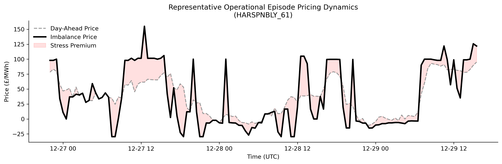
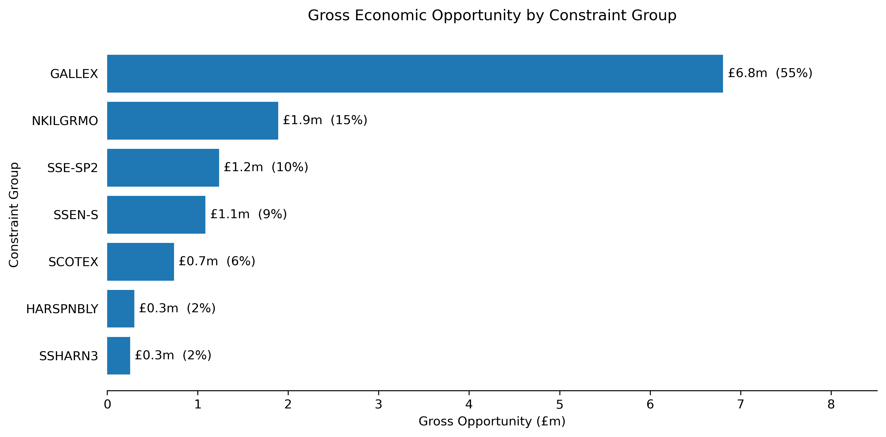
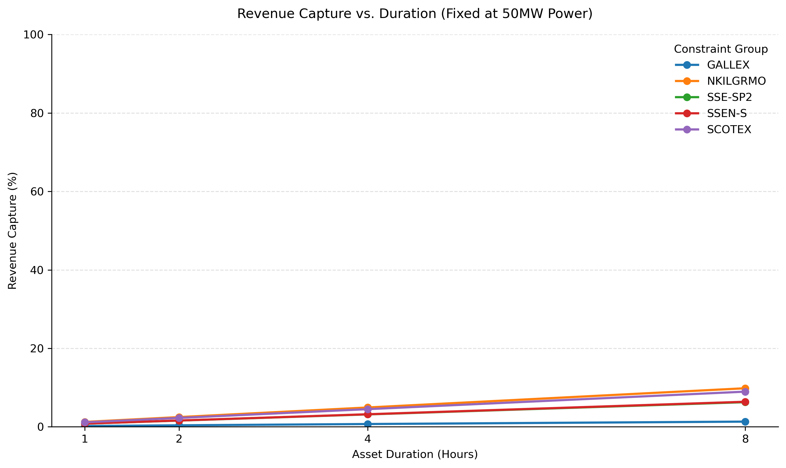
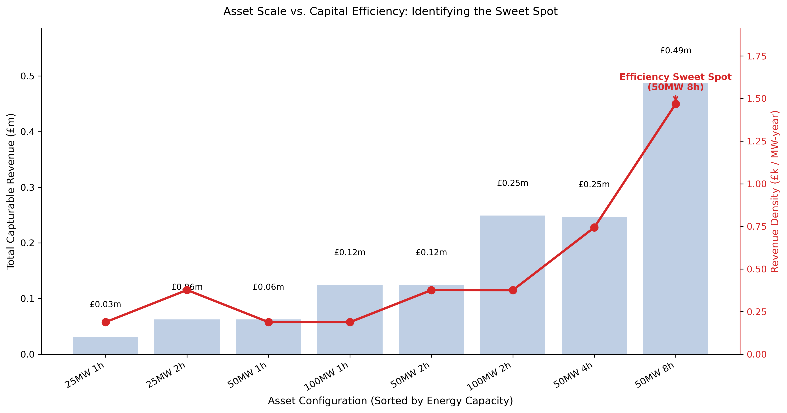

# GB Constraint Analytics Platform

## Constraint Economics and Storage Viability in the Great Britain Electricity System

### Project Findings Report (2)

---

# Executive Summary

## Objective

This phase extends the physical analysis by evaluating the economic significance of transmission constraints.

The study investigates:

1. Whether transmission constraints create measurable economic opportunity.
2. How much of that opportunity can be captured by representative battery assets.
3. Whether captured revenues support standalone battery investment.
4. The relationship between physical system requirements and commercial incentives.

The analysis builds directly upon the operational findings established in Part I.

---

## Principal Findings

Transmission constraints create identifiable economic opportunity through periods of system stress and pricing divergence.

However, only a fraction of this opportunity is physically accessible to individual battery assets.

While larger and longer-duration assets capture more congestion-related value, the capital costs required to deploy such assets substantially exceed the revenue available from constraint-management activities alone.

The analysis therefore reveals a divergence between the assets most effective at relieving congestion and the assets most easily justified by current market economics.

---

## Key Conclusions

1. Constraint opportunity is highly concentrated across a small number of transmission boundaries.
2. Physical congestion creates measurable economic value.
3. Individual battery assets capture only a small proportion of total opportunity.
4. Longer-duration assets capture more value but require substantially greater investment.
5. Constraint-management revenue alone is insufficient to support standalone battery investment.
6. The physical characteristics favoured by the network differ from those favoured by market economics.

---

# 1. Introduction

## Motivation

Part I established that North-West transmission constraints exhibit persistence, clustering and operational significance.

Part II asks a different question:

> Do these physical constraints create sufficient economic value to justify battery investment?

The analysis therefore shifts from engineering feasibility to economic viability.

---

# 2. Economic Opportunity

## Finding 1 — Physical Constraints Create Economic Opportunity

Periods of elevated network stress are associated with measurable pricing divergence between market reference prices and balancing outcomes.

These pricing effects create identifiable economic opportunity.

### Implication

Transmission constraints are not purely engineering phenomena; they also influence market outcomes.

Caption:

Physical congestion is associated with elevated system stress and pricing divergence.

---

## Finding 2 — Opportunity is Highly Concentrated

Economic opportunity is not evenly distributed across the network.

A small number of constraint groups account for the vast majority of identified opportunity.

### Implication

Location matters.

Caption:

Economic opportunity is highly concentrated within a small number of transmission constraints.

---

# 3. Revenue Capture

## Finding 3 — Gross Opportunity Differs from Capturable Opportunity

Theoretical system-wide opportunity substantially exceeds what can be captured by any individual battery asset.

Physical asset limitations restrict accessible value.

### Implication

Gross opportunity should not be confused with investable opportunity.

Caption: The Opportunity Funnel. Transmission constraints generate £526m in theoretical Gross Opportunity, but physical power and energy limits restrict accessible revenue to just £5m of Capturable Opportunity. When annualised, this £0.76m revenue stream fails to cover basic operating costs, demonstrating that constraint-management value alone cannot support standalone BESS investment.
Why these tweaks help:

---

## Finding 4 — Power Remains the Dominant Limitation

Consistent with Part I, power capability limits participation before energy capacity becomes binding.

Many opportunities are simply too large for representative assets to fully exploit.

### Implication

The scale of transmission congestion exceeds the capability of individual storage assets.

Caption:

Larger assets capture more value, but physical limitations prevent full capture of system-wide opportunity.

---

# 4. Asset Economics

## Finding 5 — Constraint Revenue Alone Does Not Support Investment

Constraint-management revenues fall substantially short of the levels required to support standalone investment.

For all tested configurations:

Annual Revenue < Annual Fixed O&M

### Implication

Constraint management is not a standalone business model.

Caption:

Constraint-management revenues remain substantially below operating cost requirements.

---

## Finding 6 — Longer Duration Creates a Physical-Economic Trade-Off

Longer-duration assets are physically superior at managing persistent congestion.

However, they also require significantly greater capital investment.

The assets best aligned with network requirements are therefore not necessarily the assets best aligned with current commercial incentives.

### Implication

Physical optimisation and financial optimisation lead to different answers.

Caption:

The physical sweet spot and the economic sweet spot do not coincide.

---

# 5. Strategic Conclusions

## Finding 7 — The Grid and the Market Reward Different Assets

The most important finding of the project is the divergence between:

- Physical Effectiveness
    and
- Economic Viability.

The network increasingly benefits from longer-duration flexibility capable of supporting persistent congestion.

Current investment economics favour shorter-duration assets with lower capital requirements.

### Implication

Future flexibility requirements and current market incentives may not be fully aligned.

Caption:

Longer-duration assets are physically superior for congestion relief, while shorter-duration assets remain easier to justify economically. The absence of assets in the upper-right quadrant highlights a key project finding: the configurations most effective for relieving congestion are not necessarily those most strongly supported by current market economics.

---

# 6. Discussion

The project began with a question about transmission congestion.

It concludes with a broader observation:

Persistent congestion creates real engineering challenges and measurable economic opportunity.

However, the scale of those challenges exceeds the capability of individual battery assets and the resulting revenues are insufficient to support standalone investment.

Storage remains valuable.

But storage alone cannot resolve structural transmission bottlenecks.

---

# 7. Limitations

* Historical analysis only.
* Parametric MW conversion.
* No revenue stacking.
* No dispatch optimisation.
* No future network reinforcement assumptions.

---

# 8. Conclusions

## Principal Conclusions

1. Physical congestion creates measurable economic opportunity.
2. Opportunity is highly concentrated.
3. Most opportunity is inaccessible to individual assets.
4. Power remains the dominant design constraint.
5. Constraint revenues alone do not support standalone battery investment.
6. Longer-duration assets better address congestion but face larger economic hurdles.
7. Physical system requirements and market incentives are not perfectly aligned.

---

# 9. Future Work

Potential future extensions include:

* Revenue stacking
* Arbitrage economics
* Ancillary service revenues
* Carbon-abatement analysis
* Long-duration storage assessment
* Market-design evaluation
